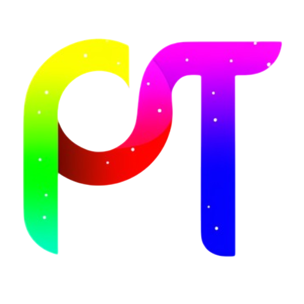

<p align="center">
  
</p>

<h1 align="center">PeekText</h1>

<p align="center">
  <b>Give Your Text the Spotlight it Deserves.</b><br>
  ✨ Create stunning 3D "text behind image" effects online – for free.
</p>

<p align="center">
  <a href="https://github.com/Ashish-Patnaik/PeekText">
    
  </a>
  <a href="https://github.com/Ashish-Patnaik/PeekText/issues">
    
  </a>
  <a href="https://peek-text.vercel.app/">
    
  </a>
</p>

<br>

---

## 🚀 What is PeekText?

**PeekText** is a free, online tool that empowers users to effortlessly create captivating "text behind image" effects. Upload your image, add and customize text using a variety of powerful editing options, and generate visuals with a striking 3D depth illusion.

It's the perfect solution for making your social media posts, presentations, website banners, or any creative project stand out. PeekText makes professional-looking design effects accessible, quick, and fun!

---

## ✨ Features

* **Easy Image Upload:** Use your own images (JPG, PNG, WebP, etc.).
* **Intuitive Text Editor:** Add and modify text directly on your image canvas.
* **Font Variety:** Choose from a selection of fonts to match your style.
* **Rich Styling:** Customize text with solid **Colors** or dynamic **Gradients**.
* **Depth Effects:** Apply **Shadow** and **Blur** for added realism.
* **Precise Control:** Adjust text placement with **X-Y Movement** and **Rotation**.
* **Core 3D Effect:** Automatically generates the "text behind image" illusion.
* **Instant Preview:** See your changes in real-time.
* **Web-Based:** Works directly in your browser – no installation needed!
* **Completely Free:** Create amazing effects at no cost.

---

## 🌈 Sample Use Case

Imagine uploading a scenic landscape photo. You add the location name as text, pick a bold font, maybe add a subtle gradient and shadow. With PeekText, the text intelligently appears *behind* elements like mountains or trees in the foreground, creating an immersive and professional 3D look – all achieved in just a few clicks!

<p align="center">
  <a href="https://compress-quick.vercel.app/">
    
  </a>
</p>


---

## 🖼️ Gallery Showcase

Here are some examples of what you can create with PeekText:


<p align="center">
  
  <br><em>Example 1</em>
</p>
<br>

<p align="center">
  
  <br><em>Example 2</em>
</p>
<br>
<p align="center">
  
  <br><em>Example 3</em>
</p>


---

## 🧑‍💻 Tech Stack 

* **Frontend**: React, CSS, JavaScript
* **Text & Image Manipulation**: Canvas, background remover
* **Deployment**: Vercel

---

## 🚧 Status: MVP

This is the **Minimum Viable Product (MVP)** release of PeekText. It provides the core functionality for creating the text-behind-image effect.

**Future plans include:**
* More fonts and customization options.
* Improved masking/selection tools.
* Enhanced performance.
* Various export options (e.g., higher resolution, different formats).

---

## 🌐 Try It Live!

👉 **[Use PeekText Online Now](https://peek-text.vercel.app/)**

---

## 📂 Installation & Local Setup (For Developers)

If you want to run PeekText locally or contribute:

1.  **Clone the repository:**
    ```bash
    git clone https://github.com/Ashish-Patnaik/PeekText.git
    ```
2.  **Navigate to the directory:**
    ```bash
    cd PeekText
    ```
3.  **Then:**
    ```bash
      npm run dev
    ```

---

## 📄 License

This project is currently not under any specific open-source license. All rights are reserved by the owner.

---

*Created by [Ashish Patnaik](https://github.com/Ashish-Patnaik)*
